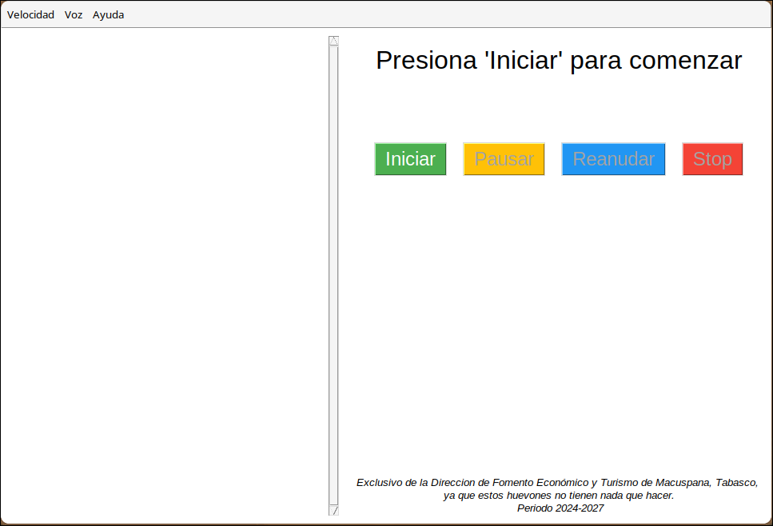
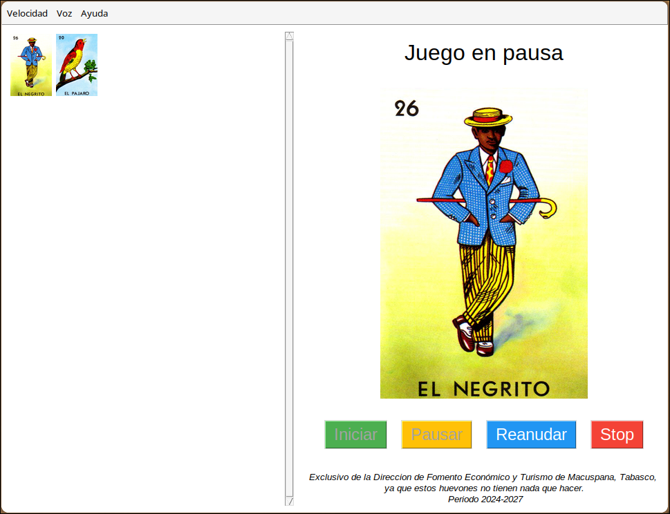

# Loteria Mexicana
un programa de loteria (cantar cartas) automatico hecho con Python




Antes de realizar la ejecucion del programa, se debe instalar mpg123 y agregarlo al path para su correcta funcionalidad.

Puede descargar mpg123 desde:
https://www.mpg123.de/download.shtml
## Instrucciones (Español)
1. Clona el proyecto con el comando:
```
git clone
```
2. Accede al directorio del proyecto con el siguiente comando:
```
cd loteria-mexicana
```
3. Ejecutar la aplicacion con el comando:
```
python3 loteria.py
```
o

```
python loteria.py
```
dependiendo de tu configuracion